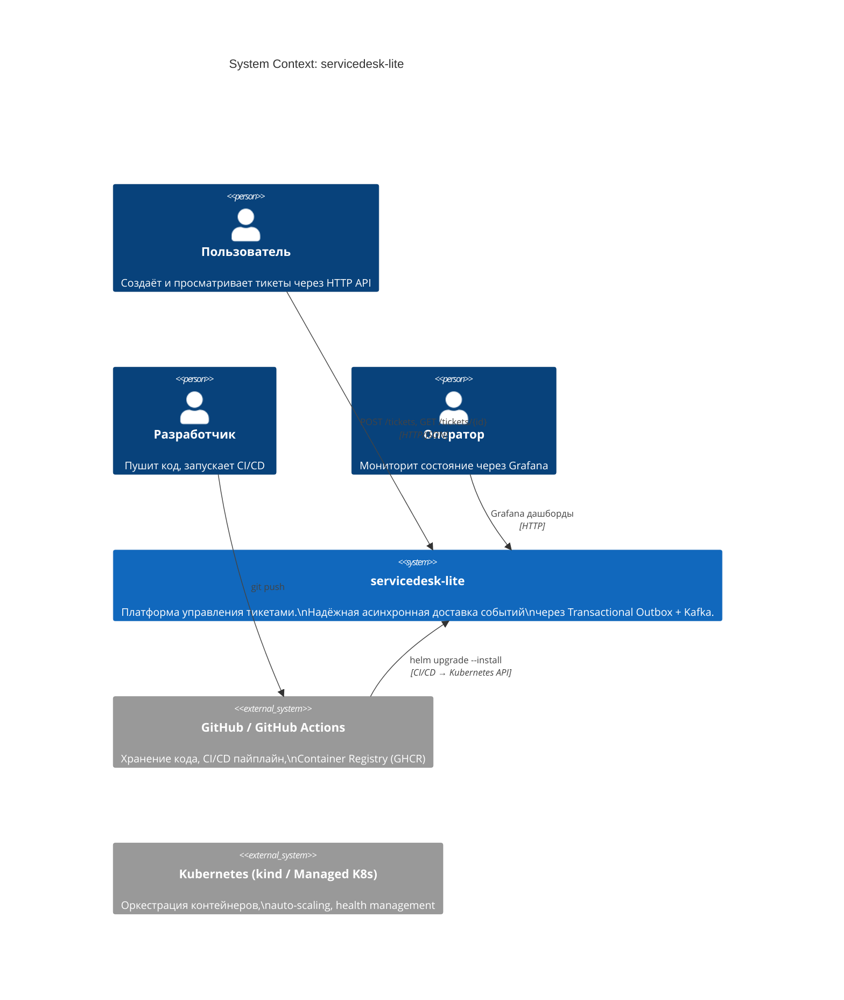
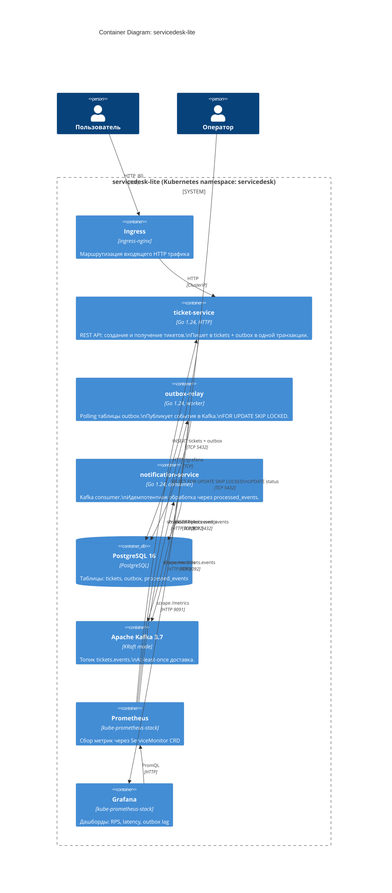
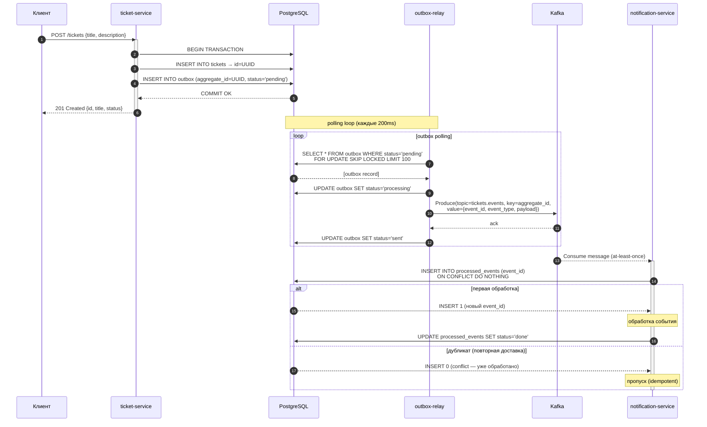
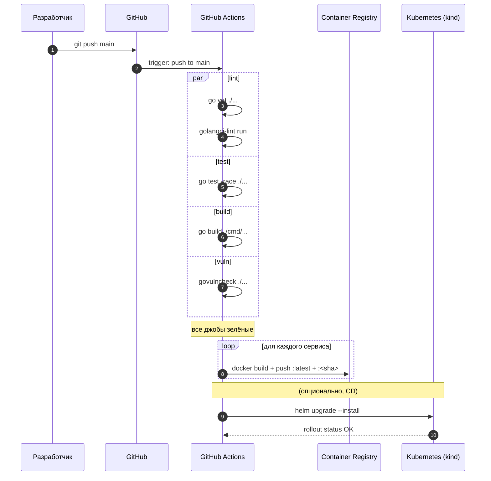

# Диаграммы

Все диаграммы написаны в формате [Mermaid](https://mermaid.js.org/) — рендерятся в GitHub, VS Code (плагин Markdown Preview Mermaid) и draw.io (import).

---

## C4 Level 1 — Context (Контекст системы)

Показывает систему целиком, внешних пользователей и смежные системы.

---

## C4 Level 2 — Container (Контейнеры)

Показывает отдельные процессы/сервисы внутри системы и их взаимодействие.

---

## Sequence Diagram — Создание тикета (E2E)

Полный путь от HTTP-запроса до идемпотентной обработки consumer'ом.

---

## Sequence Diagram — CI/CD пайплайн

