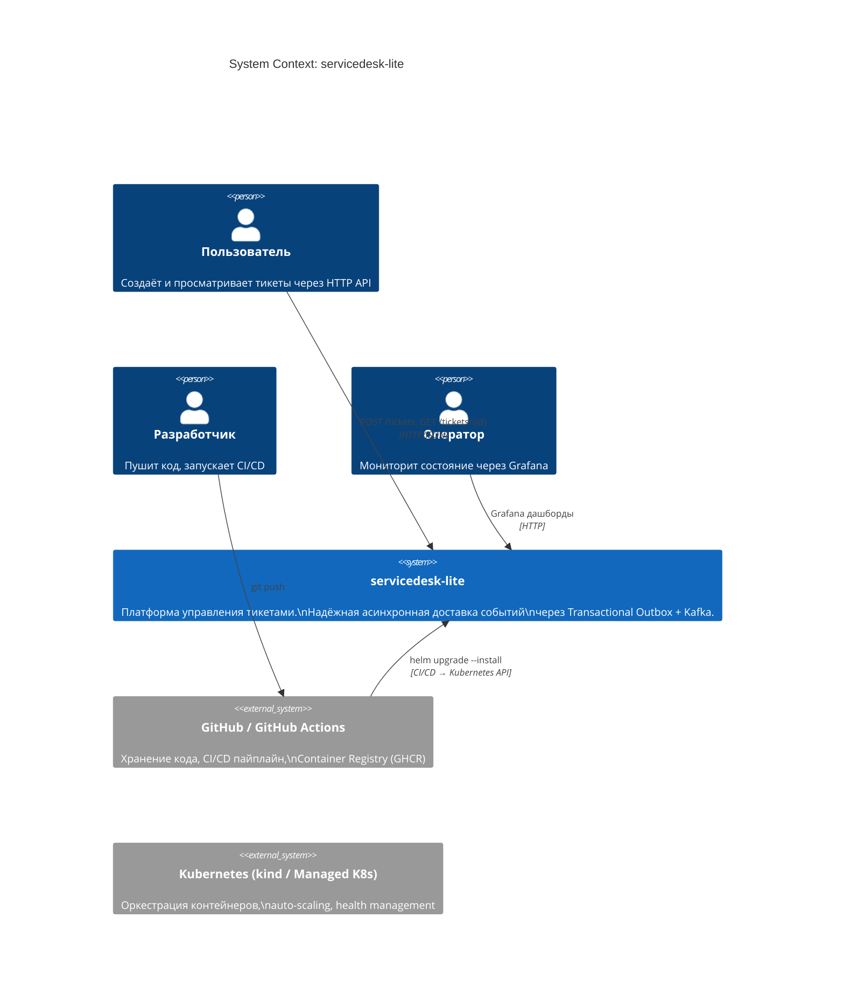
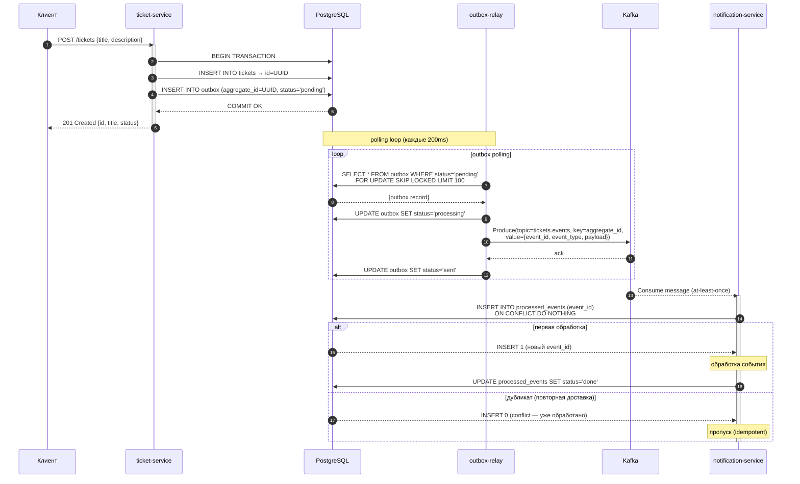
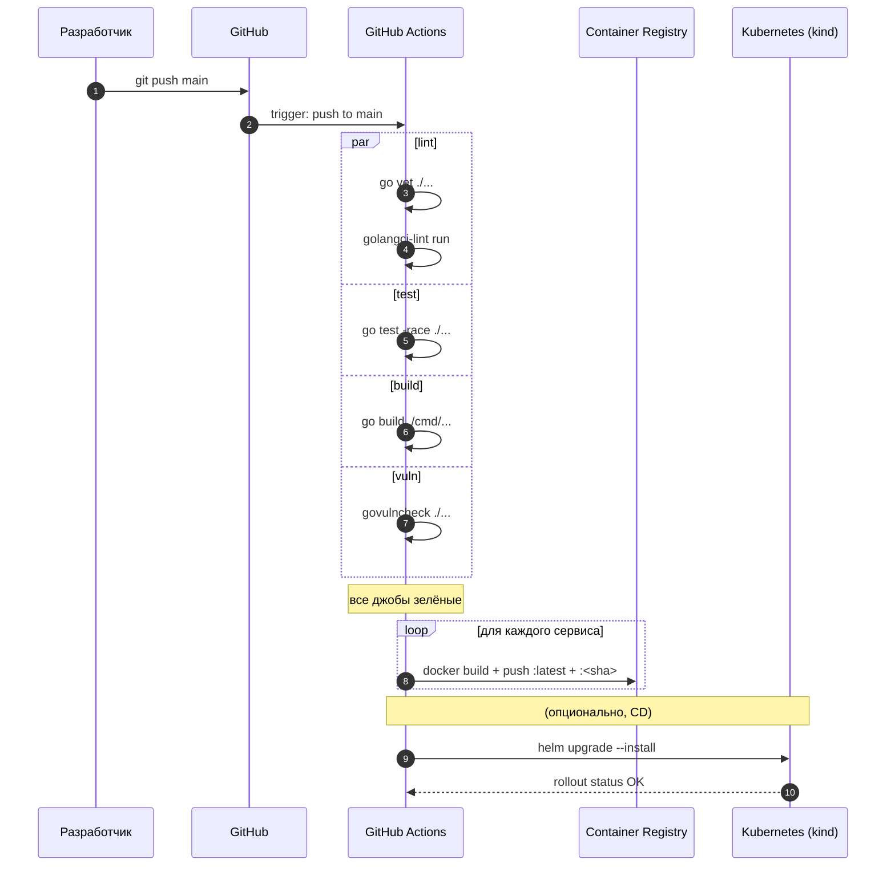

# Диаграммы

Все диаграммы написаны в формате [Mermaid](https://mermaid.js.org/) — рендерятся в GitHub, VS Code (плагин Markdown Preview Mermaid) и draw.io (import).

---

## C4 Level 1 — Context (Контекст системы)

Показывает систему целиком, внешних пользователей и смежные системы.

```mermaid
C4Context
  title System Context: servicedesk-lite

  Person(user, "Пользователь", "Создаёт и просматривает тикеты через HTTP API")
  Person(dev, "Разработчик", "Пушит код, запускает CI/CD")
  Person(ops, "Оператор", "Мониторит состояние через Grafana")

  System(sd, "servicedesk-lite", "Платформа управления тикетами.\nНадёжная асинхронная доставка событий\nчерез Transactional Outbox + Kafka.")

  System_Ext(github, "GitHub / GitHub Actions", "Хранение кода, CI/CD пайплайн,\nContainer Registry (GHCR)")
  System_Ext(k8s, "Kubernetes (kind / Managed K8s)", "Оркестрация контейнеров,\nauto-scaling, health management")

  Rel(user, sd, "POST /tickets, GET /tickets/{id}", "HTTP/JSON")
  Rel(ops, sd, "Grafana дашборды", "HTTP")
  Rel(dev, github, "git push")
  Rel(github, sd, "helm upgrade --install", "CI/CD → Kubernetes API")
```

---

## C4 Level 2 — Container (Контейнеры)

Показывает отдельные процессы/сервисы внутри системы и их взаимодействие.

---

## Sequence Diagram — Создание тикета (E2E)

Полный путь от HTTP-запроса до идемпотентной обработки consumer'ом.

```mermaid
sequenceDiagram
  autonumber
  participant Client as Клиент
  participant TS as ticket-service
  participant PG as PostgreSQL
  participant Relay as outbox-relay
  participant Kafka as Kafka
  participant Notify as notification-service

  Client->>TS: POST /tickets {title, description}
  activate TS

  TS->>PG: BEGIN TRANSACTION
  TS->>PG: INSERT INTO tickets → id=UUID
  TS->>PG: INSERT INTO outbox (aggregate_id=UUID, status='pending')
  PG-->>TS: COMMIT OK
  TS-->>Client: 201 Created {id, title, status}
  deactivate TS

  Note over Relay,PG: polling loop (каждые 200ms)
  loop outbox polling
    Relay->>PG: SELECT * FROM outbox WHERE status='pending'<br/>FOR UPDATE SKIP LOCKED LIMIT 100
    PG-->>Relay: [outbox record]
    Relay->>PG: UPDATE outbox SET status='processing'
    Relay->>Kafka: Produce(topic=tickets.events, key=aggregate_id,<br/>value={event_id, event_type, payload})
    Kafka-->>Relay: ack
    Relay->>PG: UPDATE outbox SET status='sent'
  end

  Kafka-->>Notify: Consume message (at-least-once)
  activate Notify
  Notify->>PG: INSERT INTO processed_events (event_id)<br/>ON CONFLICT DO NOTHING
  alt первая обработка
    PG-->>Notify: INSERT 1 (новый event_id)
    Note over Notify: обработка события
    Notify->>PG: UPDATE processed_events SET status='done'
  else дубликат (повторная доставка)
    PG-->>Notify: INSERT 0 (conflict — уже обработано)
    Note over Notify: пропуск (idempotent)
  end
  deactivate Notify
```

---

## Sequence Diagram — CI/CD пайплайн

```mermaid
sequenceDiagram
  autonumber
  participant Dev as Разработчик
  participant GH as GitHub
  participant CI as GitHub Actions
  participant GHCR as Container Registry
  participant K8s as Kubernetes (kind)

  Dev->>GH: git push main
  GH->>CI: trigger: push to main

  par lint
    CI->>CI: go vet ./...
    CI->>CI: golangci-lint run
  and test
    CI->>CI: go test -race ./...
  and build
    CI->>CI: go build ./cmd/...
  and vuln
    CI->>CI: govulncheck ./...
  end

  Note over CI: все джобы зелёные

  loop для каждого сервиса
    CI->>GHCR: docker build + push :latest + :<sha>
  end

  Note over CI,K8s: (опционально, CD)
  CI->>K8s: helm upgrade --install
  K8s-->>CI: rollout status OK
```
